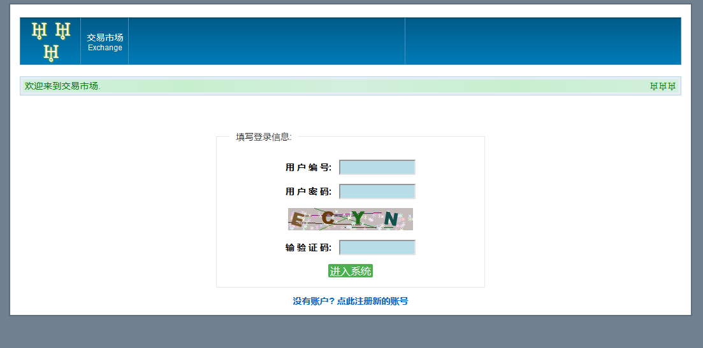
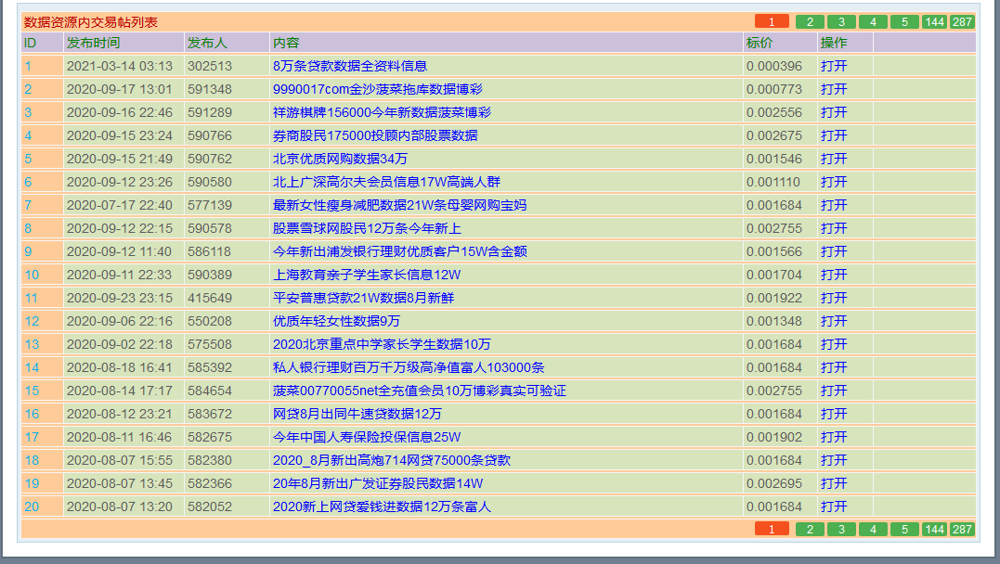

# 暗网爬虫

爬取暗网交易论坛的数据部分,结果保存在result.txt

用来监控,供安全研究者使用

## 代理设置

1. 安装tor
2. 如果在墙内需要设置前置代理
3. python的代理需要设置为socks5h

### socks5h和socks5的区别

socks5h由socks server解析hostname

socks5由本地解析hostname

## 关于暗网交易论坛

一个中文的地下交易论坛

